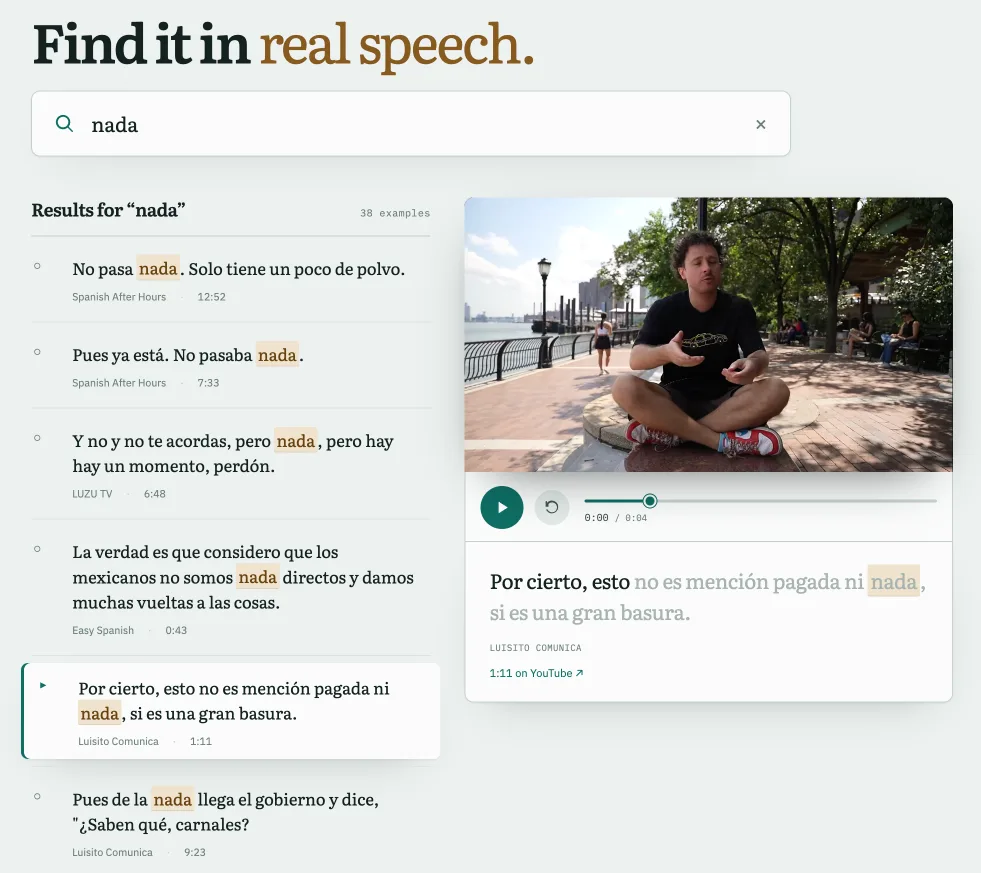

# Native Speech Retrieval for Language Learning

[](https://github.com/anton-dergunov/spoken-usage-retrieval/actions/workflows/ci.yml)

Find **real examples of words and phrases in native speech**, and play the exact video moment where
each one is spoken.

The project builds a searchable corpus from curated YouTube channels, retrieves occurrences of a
target word or phrase, ranks the most useful examples, and returns the precise segments where the
expression is used. It is both a reusable component for a language-learning application and an
experimental platform for information-retrieval work on phrase matching, speech–text alignment, and
example-quality ranking.



*Web demo: search results from native Spanish speech with the matching video excerpt.*

## Current state

A working Spanish subtitle-only baseline. No video or audio is downloaded.

- channel discovery and caption acquisition via `yt-dlp`, with creator-authored captions preferred
  and original-language automatic captions as a visible fallback;
- timestamp-aware reconstruction of complete utterances from caption events;
- exact, accent-tolerant retrieval of words and contiguous 1–5-word phrases;
- deterministic ranking, cross-video diversification, and a JSON API;
- a React viewer that plays only the relevant excerpt and renders progressive subtitles itself.

Not yet: other languages, inflected-form search, translation, forced alignment, and any learned
ranking. Those are the [roadmap](docs/plans/README.md).

## Quick start

Requirements: Python 3.12+, Node.js 22+, [uv](https://docs.astral.sh/uv/), npm, and network
access for the acquisition step.

```bash
uv sync --locked
npm ci --prefix web

# Cache ten successfully captioned videos across the four MVP channels.
uv run speech-retrieval download-subtitles --limit 10

# Reconstruct utterances and build data/index/corpus.sqlite3.
uv run speech-retrieval build-index --max-ngram 5

# Build and serve the interface at http://127.0.0.1:8000.
npm --prefix web run build
uv run speech-retrieval serve --port 8000
```

`download-subtitles` is the only quick-start command that contacts YouTube. Its limit counts usable
cached transcripts, not attempted videos, and repeat runs reuse valid cache entries. Pass
`--channels`, `--data-dir`, `--scan-limit`, or `--max-ngram` to experiment without changing defaults.
The repository scripts remain available as compatibility wrappers around the same CLI handlers.

For frontend development, serve the API once with a production build present, or construct it from
`speech_retrieval.api.create_app`, then run `npm --prefix web run dev`; Vite proxies `/api` to port
8000.

### Tests

```bash
uv sync --locked --extra dev
uv run ruff check .
uv run ruff format --check .
uv run mypy
uv run pytest
uv run speech-retrieval smoke
npm --prefix web run test
npm --prefix web run build
```

The smoke command builds and queries a temporary synthetic corpus, exercises the JSON API, and uses
no network, API key, model download, or local `data/` directory.

## How it works

```text
channel catalogue → discovery → caption cache → segmentation → index → retrieval → ranking → viewer
```

Acquired captions are immutable; segmentation, indexes, and everything downstream are rebuildable.
Acquisition, corpus representation, retrieval, ranking, and presentation stay separate, so the
pipeline is usable as a library and service without the demo.

Segments are complete utterances rather than caption cues: caption events are accumulated and closed
at terminal punctuation, a pause, or a hard duration/token limit, and the reason is kept because a
segment that ended at punctuation is better evidence than one that hit the limit.

The reasoning behind these choices, the measured baseline from the first real corpus run, the known
constraints, and the open research questions are in [`docs/design.md`](docs/design.md).

## Corpus configuration

The executable Spanish MVP subset is [`config/mvp_channels.json`](config/mvp_channels.json); the
broader curated catalogue is `spanish_youtube_channels.json`. The
[multilingual corpus plan](docs/plans/02-multilingual-corpus-model.md) consolidates them under
`config/channels/`, keeping explicit enablement, speech-style, regional-variety, and descriptive
metadata.

Source selection optimizes linguistic diversity rather than volume: street interviews, unscripted
conversation, podcasts, travel, documentary, educational material, scripted comedy, and journalism,
across several regional varieties.

## Data and licensing

Project-authored code, documentation, and synthetic test fixtures are licensed under the
[MIT License](LICENSE). Captions, videos, audio, datasets, and models obtained from third parties
retain their own copyrights and license terms; the project license does not grant permission to
redistribute them.

Generated corpus data stays local and untracked by default:

```text
data/
├── raw/videos/<video_id>/       # acquired metadata and captions; immutable inputs
├── derived/                     # rebuildable segments and debug artifacts
├── index/corpus.sqlite3         # rebuildable search index
└── reports/                     # acquisition and index-build reports
```

These generated formats have no stability or compatibility guarantee until
[Plan 02](docs/plans/02-multilingual-corpus-model.md) defines the versioned multilingual corpus
schema. A small fixture, dataset, label set, report, or model artifact may be deliberately published
when redistribution is permitted, its size is reasonable, and it materially improves
reproducibility. Its source, license, and purpose must be documented alongside it. Credentials,
cookies, tokens, and personal environment files must never be committed.

## Documentation

- [`docs/design.md`](docs/design.md) — architecture, design decisions, measured baseline, known
  constraints, open questions.
- [`docs/plans/README.md`](docs/plans/README.md) — the ordered roadmap. Foundations and multilingual
  retrieval first, then an integration-ready service and reusable player, then viewer quality and
  retrieval science in parallel, then scaling and release. Integration into the host application
  deliberately comes before the translation, audio, alignment, and ranking research, so that later
  work improves a system already in real use.
- [`experiments/index.md`](experiments/index.md) — dated, reproducible experiments and their
  findings, including negative results.
